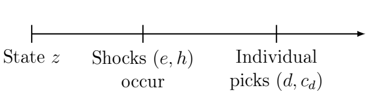

## Contribution
**Framework:**
Simultaneous discrete-continuous choice

- Core identification problem: only observe continuous choice for the chosen discrete alternative

**Identification:**
Constructive proof of nonparametric identification

- Instrument: *relevant* for discrete choice, *excluded* from continuous choice

**Estimation:** Two-step estimation 

- 1) read CCC and CCP from data  
- 2) structrual estimation to recover parameters

## Plan
- **Framework**: Static
- **Identification**: Static
- **Framework**: Dynamic
- **Identification**: Dynamic

## Framework: Static
:::: {.columns}

::: {.column width="50%"}
**Timeline**

**Shocks:** 

- $e = (e_0 , e_1) \in \mathbb{R}^2$ only discrete choice for one alternative, drawn from $\epsilon$
- $h \in \mathbb{R}$ shocks discrete and continuous for both alternatives, drawn from $\eta$
:::

::: {.column width="50%"}
**State Variables:** $z$

**Choices:**

- $d \in {0,1}$ discrete choice
- $c_d \in \mathbb{R}$ continuous choice given $d$

**Payoffs:**

$$\max_{d, c_d} V_d(c_d,z,h,e_d)$$
:::

::::

## Framework: Assumptions
1. **Additive Separability:** $e$ enters the payoff additively, for each $d$
$$V_d(c_d,z,h,e_d) = \tilde{v}_d (c_d,z,h) + e_d$$

Assumption 1 implies: conditional policy $c^{*}_d$ does not depend on $e$

2. **Instrument:** $z = (x,w)$ and $w$ does not enter the conditional continuous choice
$$\tilde{v}_d (c_d,z,h) = v_d (c_d,x,h) + m_d(x,w,h)$$

Assumption 2 implies: conditional policy $c^{*}_d$ does not depend on $w$

## Framework: More Assumptions
3. **Monotonicity:** $v_d$ is twice continuously differentiable and $\frac{\partial^2v_d(c_d,z,h)}{\partial c_d \partial h} > 0$

Assumption 3 implies: 

- given $d$ and $x$, $c^{*}_d(z,h)$ is one-to-one with $h$\
- the framework requires non-trivial continuous choice for each discrete choice

4. **Shocks:** Conditional on $X = x$, (i) $W, \eta, \epsilon$ are mutually independent, (ii) $\eta$ drawn from $Uniform(0,1)$, (iii) $\epsilon$ is continuouslly distributed with full support/, and (iv) $\max_{c} \tilde{v}_d (c, x,w,h) < \infty$ for all $(x,w,h,d)$.

5. **Instrument Relevance:** For every $x$, 
$P(D = 0 | \eta = h, X = x, W = 1) \neq P(D = 0 | \eta = h, X = x, W = 0)$, for all $h \in \mathcal{H} \backslash \mathcal{K}_x$, where $\mathcal{K}_x$ is a possibly empty finite set.

## Framework: Example - Static Energy Demand
**Decision Problem**: 
$$\max_{d, c_d} \{v_d(c_d,x,h) + m_d(x,w,h) + e_d \}$$

:::: {.columns}

::: {.column width="50%"}
**Energy Sources**: Discrete $d = 0 \text{ or } 1$

**Energy Demand**: Continuous $c_0$ and $c_1$

**Characteristics**: $x$, cost, income, etc

**Instrument**: $w$, e.g. previous energy source
:::

::: {.column width="50%"}
**Taste Shock**: $e_d$ specific to sources

**Demand Shock**: $h$, shifts $c_d$ for $d = 0 \text{ and } 1$, also enters the discrete choice
:::

::::

## Framework: Example - Implication of Assumptions
**Decision Problem**: 
$$\max_{d, c_d} \{v_d(c_d,x,h) + \underbrace{m_d(x,w,h) + e_d}_{\text{discrete choice shock}}\}$$

**Instrument Shifts Conditional Choice Probability:**
$$
\begin{align}
 &P(D = 0 | \eta = h, X = x, W = 1) \\
 &= P(e_0 - e_1 > \max_{c_1}v_1(c_1,x,h) - \max_{c_0}v_0(c_0,x,h)+ \\
 & m_1(x,w,h)-m_0(x,w,h)| \eta = h, X = x, W = w)
\end{align}
$$

## Framework: Example - Implication of Assumptions
**Instrument Shifts Conditional Choice Probability:**
$$
\begin{align}
 &P(D = 0 | \eta = h, X = x, W = 1) \\
 &= P(e_0 - e_1 > \max_{c_1}v_1(c_1,x,h) - \max_{c_0}v_0(c_0,x,h)+ \\
 & m_1(x,w,h)-m_0(x,w,h)| \eta = h, X = x, W = w)
\end{align}
$$

since $(e_0,e_1) \perp (W,\eta) | X = x$ (A4) and 

$\max_{c_1}v_1(c_1,x,h) - \max_{c_0}v_0(c_0,x,h)$ independent of $w$ (A2).

We have that (A5) is equivalent to an assumption on discrete choice shock: 
$$
\begin{align}
 P(D = 0 | \eta = h, X = x, W = 1) \neq P(D = 0 | \eta = h, X = x, W = 0) \\
 \iff m_1(x,w=1,h)-m_0(x,w=1,h) \neq m_1(x,w=0,h)-m_0(x,w=0,h)
\end{align}
$$

## Identification: Static
**Data:** $(D,C,W)$, we omit $X$ as it is exogenous and $\epsilon,W,\eta$ mutually independent when fixing on $X=x$

**Structures to be Identified:**\
-Conditional Continuous Choices: $c^{*}_d(h)$   
-Conditional Choice Probability: $P(D = d | \eta = h, W = w)$   
-Indirect Payoffs: $\max_{c}v_d(c,h)$ and $m_d(w,h)$

**Reduced Forms Recovered from Data:**\
-Distribution of Continuous Choice given $d$ and $w$: $F_{C_d|d,w}(c_d) = P(C_d < c_d | d, w)$\
-Choice Probability given $w$: $p_{D|w}(d) = P(d|w)$

## Identification: Lemmas
**Lemma 1:** Under Assumption 3 and 4, $F_{C_d|d,w}(c_d) = P(C_d < c_d| d, w)$ is continuously differentiable and strictly increasing, for $d = 0,1$.

-**Intuition:** **Monotonicity** implies that $h$ and $c^{*}_d(h)$ are one-to-one given $d,w$. We have that $F_{\eta|d,w}$ is continuously differentiable and strictly increasing, so $F_{C_d|d,w}$ inherits these properties.

**Lemma 2:** Under Assumption 5, $\frac{\partial F_{C_d|d,1}(c_d)p_{D|1}(d)}{\partial c_d} \neq \frac{\partial F_{C_d|d,0}(c_d)p_{D|0}(d)}{\partial c_d}$ for $d = 0,1$, where $h \in \mathcal{H} \backslash \mathcal{K}_x$, where $\mathcal{K}_x$ is a possibly empty finite set.

-**Intuition:** Given the same discrete choice, individual with different $w$ experienced different distributions of $h$ shock. Since $h$ and $c^{*}_d(h)$ are one-to-one, we can take this restriction to data.

## Identification: Conditional Continuous Choice
**Goal**: Identify $c^{*}_0(h)$ and $c^{*}_1(h)$\
**Challenge**: $P(\eta < h | D=d) = P(C_d < c^{*}_d(h)| D=d) \implies \\ c^{*}_d(h) = F_{C_d|d}^{-1}(P(\eta < h | D=d))$
$P(\eta < h | D=d)$ unobserved! 

**Identification Intuition: Fixing an $h$ and $w=1$, we have**
$$
\begin{align}
 h &= P(\eta < h)\\
   &= P(\eta < h | W = 1) \hspace{1cm} [A4]\\
   &= P(\eta < h | D=0, W = 1)P(D=0| W = 1) + \\
   &P(\eta < h | D=1, W = 1)P(D=1| W = 1)\\
   &= P(C_0 < c^{*}_0(h) | D=0, W = 1)P(D=0| W = 1) + \\
   &P(C_1 < c^{*}_1(h) | D=1, W = 1)P(D=1| W = 1)\\
   &= F_{C_0|0,1}(c^{*}_0(h))p_{D|1}(0) + F_{C_1|1,1}(c^{*}_1(h))p_{D|1}(1)
\end{align}
$$

## Identification: Conditional Continuous Choice
**Identification Intuition: Fixing an $h$ and $w=1$, we have**
$$
\begin{align}
 h = F_{C_0|0,1}(c^{*}_0(h))p_{D|1}(0) + F_{C_1|1,1}(c^{*}_1(h))p_{D|1}(1)
\end{align}
$$
Note that $F_{C_d|d,w}(.)$ and $p_{D|w}(.)$ are observed from reduced form. We have two unknowns: $c^{*}_0(h)$ and $c^{*}_1(h)$, but also an extra equation from $w=0$. Thus we can solve for the CCCs for each $h$.

**Theorem 1** For every reduced form compatible with the structural model, there exist unique conditional continuous choice (CCC) functions $c_d(h)$, $d=1,0$ that are strictly increasing and satisfy:

$$
\begin{align}
 h = F_{C_0|0,w}(c_0(h))p_{D|w}(0) + F_{C_1|1,w}(c_1(h))p_{D|w}(1) \hspace{1cm} \text{for $h \in [0,1]$, $w = 0,1$}
\end{align}
$$
Intuition as above, proof establishes uniqueness.

## Identification: Conditional Choice Probability and Payoffs
**CCP**: Identify $P(D = d | \eta = h, W = w)$

**Challenge**: $\eta$ unobserved

**Solution**: Given $c^{*}_0(h)$ and $c^{*}_1(h)$ are identified and strictly monotonic, we can recover $\eta = (c^{*}_D(h))^{-1}(C)$ from data $(D,C)$. It is then as if $(D,C,W,\eta)$ are all observed.

**Payoffs**: Identified, but depend on how the CCCs and CCPs relate to the utility/value function. 

## Framework: Dynamic
**Assumptions D1-D3**: Assumptions on the curent utility, similar to the static version but with $t$ subscript.

6. **Conditional Independence**: For all $x_t \in X$, $w_t \in W$, $e_t \in \epsilon$, $h_t \in H$,
$$
\begin{align}
  f_{X_{t+1},W_{t+1},\epsilon_{t+1},\eta_{t+1}|x_{t},w_{t},c_{t},d_{t},e_{t},h_{t}}(x_{t+1},w_{t+1},e_{t+1},h_{t+1}) = \\
  f_{X_{t+1},W_{t+1}|x_{t},w_{t},c_{t},d_{t}}(x_{t+1},w_{t+1})f_{\epsilon}(e_{t+1})f_{\eta}(h_{t+1})
\end{align}
$$
7. **Instrument Transition Exclusion**: For all $x_t \in X$, $w_t \in W$, the current instrument is excluded from the transition density:
$$
\begin{align}
  f_{X_{t+1},W_{t+1}|x_{t},w_{t},c_{t},d_{t}}(x_{t+1},w_{t+1}) =
  f_{X_{t+1},W_{t+1}|x_{t},c_{t},d_{t}}(x_{t+1},w_{t+1})
\end{align}
$$
Assumption 6 and 7 are required to fit the dynamic problem into the general framework we developed before.

## Framework: Dynamic
**The Dynamic Decision Problem:**
$$V_t(z_t) := \mathbb{E}[\sum_{\tau=t}^{T} \max_{D,C_{D \tau}} u_{D\tau}(C_{\tau}, X_{\tau}, \eta_{\tau}) + m_{D \tau}(X_{\tau}, W_{\tau}, \eta_{\tau}) + \epsilon_{D \tau}] $$

We can write it recursively, using assumption 6 and 7 
$$
\begin{align}
V_t(z_t) := \mathbb{E}_{\epsilon,\eta}[&\max_{D,C_{D \tau}}[ u_{dt}(c_{dt}, x_{t}, \eta_{t}) + m_{dt}(x_{t}, w_{t}, \eta_{t}) + \epsilon_{dt} + \\
& \beta \mathbb{E}_{Z_{t+1}}[V_{t+1}(Z_{t+1})|X_t=x_t,C_t=c_{dt},D_t=d_t]]] 
\end{align}
$$
With the instrument excluded from the state transition, the continuation value term does not depend on $w$.

## Framework: Dynamic
Define the conditional value function:
$$v_{dt}(c_{dt},x_t,\eta_t) = u_{dt}(c_{dt}, x_{t}, \eta_{t}) + \beta \mathbb{E}_{Z_{t+1}}[V_{t+1}(Z_{t+1})|X_t=x_t,C_t=c_{dt},D_t=d_t]$$

Reformulate the per-period problem, we have:
$$\max_{d_t, c_{dt}} \{v_{dt}(c_{dt},x_t,h_t) + m_{dt}(x_t,w_t,h_t) + e_{dt} \}$$ which is of the same form as our static problem.

## Framework: Dynamic

**Lemma 3:** Under Assumptions D1-D3, 6, and 7, Assumption 1, 2, 3 are satisfied for the conditional value function in the dynamic setup.

-**Intuition:**
Assumption 1 (AS) follows from D1.\
Assumption 2 (Instrument) follows from D2 + 7 (Instrument Transition Exclusion).\
Assumption 3 (Monotonicity) follows from D3 + 6 (CI).\

$\frac{\partial^2v_{dt}(c_{dt},x_t,h_t)}{\partial c_{dt} \partial h_t} = \underbrace{\frac{\partial^2u_{dt}(c_{dt},x_t,h_t)}{\partial c_{dt} \partial h_t}}_{>0 \text{, by } D3} + \underbrace{\frac{\partial^2 \mathbb{E}_{Z_{t+1}}[V_{t+1}(Z_{t+1})|X_t=x_t,C_t=c_{dt},D_t=d_t]}{\partial c_{dt} \partial h_t}}_{=0 \text{, by } CI} > 0$

## Framework: Dynamic Example
We still need an instrument, the author proposes the previous discrete choice $W_t = D_{t-1}$.

**Decision Problem**: 
$$\max_{d_t, c_{dt}} \{v_{dt}(c_{dt},x_t,h_t) + m_{dt}(x_t,w_t,h_t) + e_{dt} \}$$

:::: {.columns}

::: {.column width="50%"}
**Energy Sources**: Discrete $d_t = 0 \text{ or } 1$

**Energy Demand**: Continuous $c_{0t}$ and $c_{1t}$

**Characteristics**: $x$, cost, income, etc

**Instrument**: $w$, e.g. previous energy source
:::

::: {.column width="50%"}
**Taste Shock**: $e_{dt}$ specific to sources

**Demand Shock**: $h_t$, shifts $c_{dt}$ for $d = 0 \text{ and } 1$, also enters the discrete choice
:::

::::

## Framework: Dynamic Example
The author argues:

1) conditional on current source of energy $d_t$ and $x_t$, future $w_{t+1}$ is known and $x_{t+1}$ is unlikely to be influenced by past choice [defending Assumption 7, Transition Exclusion]  

2) conditional on current source of energy $d_t$ and $x_t$, past choice unlikely to enter current utility function [defending Assumption D2, Exclusion] 

3) past choice likely relevant if there is a switching cost [defending Assumption 5, Relevance] 

## Identification: Dynamic 
As before, we are interested in identifying the CCCs $c^{*}_{dt}$\
CCPs $P(D_t = d_t | \eta_{t} = h_{t}, X_t = x_t, W_t = w_t)$, the transition laws, and the value function parameters.

**Data:** $(D_t,C_t,X_t,W_t,t)$

**Reduced Forms:** $R = \{P(D=d_t|X_t=x_t,W_t=w_{t}), F_{C_{dt}|d_t,x_t,w_t}(.)\}$

For CCCs and CCPs, we proceed as before, exploiting our instrumental variable.

For transition laws are non-parametrically identified from data.

The value functions are identified by extra assumptions on the $\epsilon_t$ term and on the current utility function, using existing results.

## More in the paper

-With unobserved types

-Two-step Estimation 