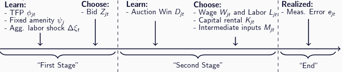
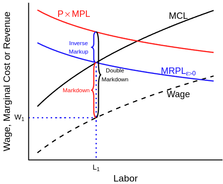
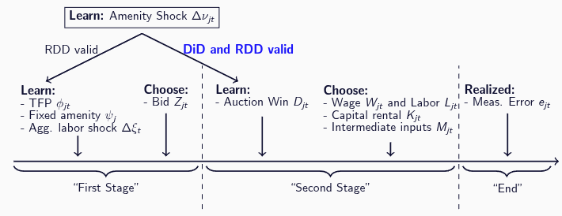
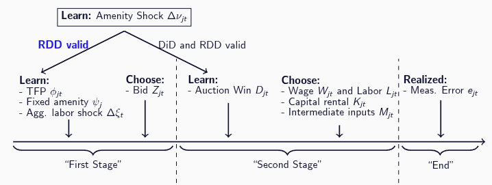
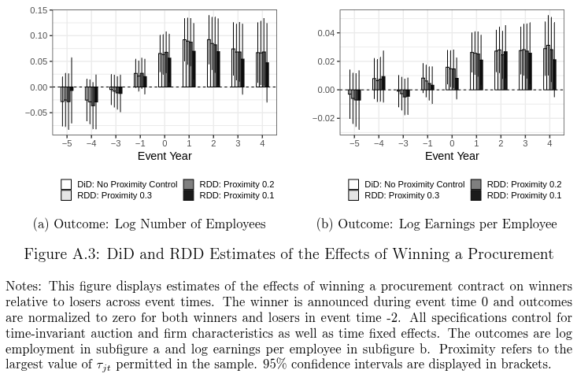
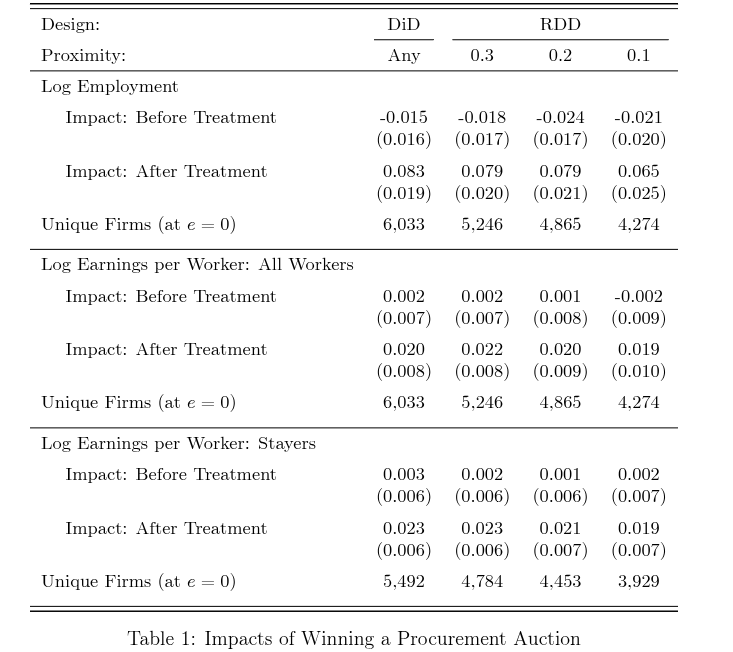
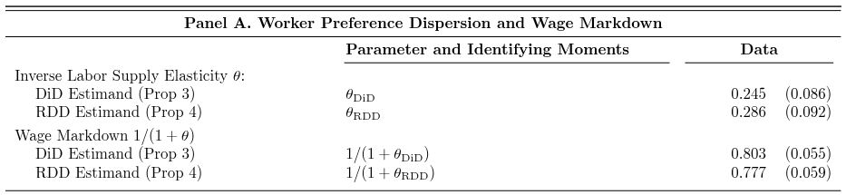
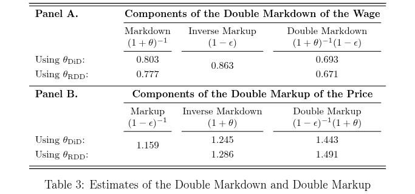
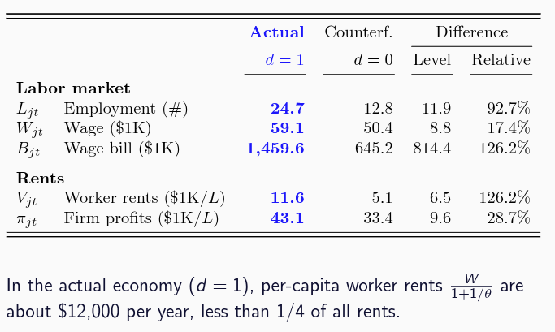

## **This Paper Starts with a Simple Observation**

**Firms Operate and Have Market Power on Two Markets**

Two sources of market power are the focus of distinct literatures:

-   [Labor market]{style="color:orange;"}: firms may mark down wages below MRPL.
-   [Product market]{style="color:blue;"}: firms may mark up prices above MC.

[When excercising labor market power, lower $L$ leads to a lower $w$ - presumably a higher markdown]{.fragment}

[But, this also means lowering $Q$, higher prices]{.fragment}

[**How important are the interaction between the two forces?**]{.fragment}

## **Why is this important? Limit to single market analyses**

How much change should we see if we increase labor market power?

::: columns{.fragment}

::: {.column width="50%"}
### Without Prod. Market Power
{width="80%"}
:::

::: {.column width="50%"}
### With Prod. Market Power
{width="100%"}
:::

:::
<!-- Why is the red steeper line represents more labor market power? -->
<!-- For the same wage decrease, lose less workers. Less elastic labor supply -->

## **This Paper**
**The logic is simple**: Labor and Product Market Power Attenuate Each Other

**But:** What are the magnitudes? 

[**Context:** U.S. Construction Sector - Firm Balance Sheets and Tax Returns]{.fragment}

::: {.fragment}

**Framework**

• Model the [product]{style="color:blue;"} and [labor]{style="color:orange;"} markets jointly

• Closed-form identification of all model parameters.

:::

## **Contribution**
The author states many contributions. I think the most important is:

**Markdown(up) determined by not only the labor(product) market elasticity**

Therefore, the effect of an intervention that work on only one market will be overestimated

## **Contribution**
**Double markdown**: Substituting into the **wage** expression,

$$
W_{jt} = \underbrace{\overbrace{(1+\theta)^{-1}}^{\substack{\text{\color{orange}labor} \\ \text{\color{orange}markdown}}} \times \overbrace{(1-\epsilon)}^{\substack{\text{\color{blue}product} \\ \text{\color{blue}inverse markup}}}} _{\text{\color{orange}double markdown}} \times \overbrace{P_{jt} \text{MPL}_{jt}}^{\text{value of MPL}}
$$

**Double markup**: Substituting into the **price** expression,

$$
P_{jt} = \underbrace{\overbrace{(1-\epsilon)^{-1}}^{\substack{\text{\color{blue}product} \\ \text{\color{blue}markup}}} \times \overbrace{(1+\theta)}^{\substack{\text{\color{orange}labor} \\ \text{\color{orange}inverse markdown}}}} _{\text{\color{blue}double markup}} \times \overbrace{\frac{W_{jt}}{\text{MPL}_{jt}}}^{\substack{\text{prod.-adjusted} \\ \text{wage}}}
$$

## **Roadmap**
-   Model and Identification
    -   Labor Market
    -   Technology
    -   Firms' Problem
-   Data
-   Quantification/Counterfactuals

## **Labor Market** {#labor-market}

**Preferences**
If employed by firm *j* at wage $W_{jt}$, worker *i*'s utility is

$$
U_{it}(j, W_{jt}) = \log W_{jt} + \log G_{jt} + \eta_{ijt} \quad (1)
$$

- $G_{jt}$ is common, gives rise to **vertical** differentiation
- $\eta_{ijt}$ is idiosyncratic to worker *i*, gives **horizontal** differentiation 
  - Parameterize $\eta_{ijt}$ as T1EV with dispersion $\theta$
      - higher $\theta$, shock more dispersed, less elastic, higher labor market power
      - worker-firm specific taste/amenity, e.g. distance to work
  - Information asymmetry: firms don’t see $\eta_{ijt}$ for a given worker

Aggregate to get labor supply curve

## **Labor Market**
**Firm-specific labor supply curve:**

$$
\textcolor{blue}{W_{jt} = L_{jt}^{\theta} U_{jt} \Rightarrow w_{jt} = \theta \ell_{jt} + u_{jt}}
$$

where 1/$\theta$ is the LS elasticity and $U_{jt}$ is the firm-specific amenity

- Strategically small: no firm can shift aggregate labor supply

**Key Estimand**: $\theta$ wage elasticity w.r.t labor

## **Technology**

**Production Function**
Firms produce using labor *L*, capital *K*, and intermediate inputs *M* in the Ackerberg et al (2015) technology,

$$
Q_{jt} = \min\{\Omega_{jt}L_{jt}^{\beta_L}K_{jt}^{\beta_K}, \beta_M M_{jt}\}\exp(e_{jt})
$$

where $\Omega_{jt}$ is TFP and $e_{jt}$ is measurement error in output; 

**Leontief: cannot subsitute concrete with labor!**

**Leontief FOC implies $\Omega_{jt}L_{jt}^{\beta_L}K_{jt}^{\beta_K} = \beta_M M_{jt}\ $**

## **Technology**
**Composite Production**
If capital market is perfect, by property of Cobb-Douglas, simplifies to

$$
Q_{jt} = \min\{\Phi_{jt}L_{jt}^{\rho}, \beta_M M_{jt}\}\exp(e_{jt})
$$

where $\rho$ is composite labor returns and $\Phi_{jt}$ is composite TFP.

**Optimal intermediate inputs**
Defining $X_{jt} \equiv p_M M_{jt}$, the Leontief FOC and competitive market for intermediate inputs gives,

$$
\textcolor{blue}{X_{jt} = \frac{p_M}{\beta_M} L_{jt}^{\rho}\Phi_{jt} \Rightarrow x_{jt} = \kappa_X + \rho\ell_{jt} + \phi_{jt}}
$$

**Key Estimand**: $\rho = (1+\theta) \beta_K + \beta_L$ 

## **Firm's Problem**

**Output**
Let *G* denote govt market and *H* denote private market.
Denote output in *G* by $Q_{Gjt}$ and in *H* by $Q_{jtH}$

-   First-stage: Firms bid to produce $\bar{Q}_G$, $D_{jt} = 1$ if winner
-   Second-stage: Choose total output $Q_{jt} = \bar{Q}_G D_{jt} + Q_{Hjt}$

**Timeline**
{width="100%"}

## **Firm's Problem**

**Private Market**
Firms face downward-sloping demand,

$$
P_{jtH} = p_H (Q_{jtH})^{-\epsilon} \Rightarrow \textcolor{blue}{R_{jtH} = p_H (Q_{jtH})^{1-\epsilon} \Rightarrow r_{jtH} = \kappa_R + (1-\epsilon)q_{Hjt}}
$$

**Key Estimand** $\textcolor{blue}{\frac{1}{\epsilon}}$ the price elasticity of demand

**Firm's Problem**
Given $Q_j \geq \bar{Q}_G d$ and auction outcome $D_j=d$,

$$
\max_{L_{djt}, K_{djt}, M_{djt}} \pi_{djtH} = R_{djtH} - W_{djt}L_{djt} - p_M M_{djt} - p_K K_{djt}
$$

subject to the labor supply curve, the product demand curve, and the production function.

## **Government Market for Procurements**

**Opportunity Cost**
Given private market profits $\pi_{djtH}$ if $D_{jt}=d$,

$$
\sigma_u(\phi_{jt}) = \pi_{0Hjt} - \pi_{1Hjt} > 0
$$

The two stage set-up allows us to define this ~ valuation in regular auction

**Auction problem**
Firm *j* chooses optimal bid $Z_{jt}$ that solves,

$$
\max_{Z_{jt}} \underbrace{(Z_{jt} - \sigma_u(\phi_{jt}))}_{\text{payoff}} \times \underbrace{\text{Pr}(D_{jt}=1|Z_{jt})}_{\text{probability of winning}}
$$

## **Government Market for Procurements**
**Optimal bid**
Unique symmetric equilibrium is defined by,

$$
s_u(\phi_{jt}) = \sigma_u(\phi_{jt}) \delta_u(\phi_{jt}), \quad \delta_u(\phi_{jt}) \equiv 1 + \frac{\int_{\sigma_u(\phi_{jt})}^{\bar{\sigma}} [1 - F_u(\tilde{\sigma})]^{I-1} d\tilde{\sigma}}{\sigma_u(\phi_{jt}) [1 - F_u(\sigma_u(\phi_{jt}))]^{I-1}}
$$

where *I* is number of bidders and $\delta$ is markup on opportunity cost

Given $u$, bid is monotone in $\phi_{jt}$ - will be used as control function later

## **Key Equations**

### Firm-specific Labor Supply Curve

$$
\textcolor{blue}{W_{jt} = L_{jt}^{\theta} U_{jt} \Rightarrow w_{jt} = \theta \ell_{jt} + u_{jt}}
$$

### Optimal intermediate inputs

$$
\textcolor{blue}{X_{jt} = \frac{p_M}{\beta_M} L_{jt}^{\rho}\Phi_{jt} \Rightarrow x_{jt} = \kappa_X + \rho\ell_{jt} + \phi_{jt}}
$$

### Private Demand

$$
\textcolor{blue}{R_{jtH} = p_H (Q_{jtH})^{1-\epsilon} \Rightarrow r_{jtH} = \kappa_R + (1-\epsilon)q_{Hjt}}
$$

## **Double Market Power: First-order Condition**

**Simple Firm's Problem:** Consider a firm that does not participate in procurement auctions. The firm's problem simplifies to,

$$
\max_{L_{jt},K_{jt},M_{jt}} \pi_{jt} = Q_{jt}P_{jt} - W_{jt}L_{jt} - p_M M_{jt} - p_K K_{jt}
$$

subject to the constraints,

|                    |                                                  |
|----------------------------|--------------------------------------------------|
| Flexible prod. func.: | $Q_{jt} = f_{jt}(L_{jt}, K_{jt}, M_{jt})$     |
| Monopolistic comp.: | $P_{jt} = p_H (Q_{jt})^{-\epsilon}$             |
| Monopsonistic comp.:| $W_{jt} = L_{jt}^{\theta} U_{jt}$               |

## **Double Market Power: First-order Condition**
**First-order Condition w.r.t. Labor:**

$$
\underbrace{(1-\epsilon) \times P_{jt} \text{MPL}_{jt}}_{\text{MRPL}_{jt}} = \underbrace{(1+\theta) \times W_{jt}}_{\text{MCL}_{jt}}
$$

where $\text{MPL}_{jt} \equiv \frac{\partial Q_{jt}}{\partial L_{jt}}$, $\text{MRPL}_{jt} \equiv \frac{\partial (P_{jt} Q_{jt})}{\partial L_{jt}}$, and $\text{MCL}_{jt} \equiv \frac{\partial (W_{jt} L_{jt})}{\partial L_{jt}}$.

## **Double Market Power: First-order Condition**
**First-order Condition w.r.t. Labor:**
$$
\underbrace{(1-\epsilon) \times P_{jt} \text{MPL}_{jt}}_{\text{MRPL}_{jt}} = \underbrace{(1+\theta) \times W_{jt}}_{\text{MCL}_{jt}}
$$

::: {.fragment}
**Markdown** Rearranging the FOC, $W_{jt} = \overbrace{(1+\theta)^{-1}}^{\textcolor{orange}{\text{markdown}}} \times \text{MRPL}_{jt}$
:::

::: {.fragment}
Usual expression, except that $\text{MRPL}_{jt} \neq P_{jt}\text{MPL}_{jt}$. 

Adjust for product demand elasticity: $\text{MRPL}_{jt} = (1-\epsilon)P_{jt}\text{MPL}_{jt}$.
:::

::: {.fragment}
$$
W_{jt} = \underbrace{ \overbrace{(1+\theta)^{-1}}^{\textcolor{orange}{\text{markdown}}} \times \overbrace{(1-\epsilon)}^{\textcolor{blue}{\text{inverse markup}}} }_{\textcolor{orange}{\text{double markdown}}} \times \underbrace{P_{jt} \text{MPL}_{jt}}_{\text{value of MPL}}
$$
:::

## **Double Market Power: First-order Condition**
**First-order Condition w.r.t. Labor:**
$$
\underbrace{(1-\epsilon) \times P_{jt} \text{MPL}_{jt}}_{\text{MRPL}_{jt}} = \underbrace{(1+\theta) \times W_{jt}}_{\text{MCL}_{jt}}
$$

Double markdown: Substituting into the wage expression,

$$
W_{jt} = \underbrace{ \overbrace{(1+\theta)^{-1}}^{\textcolor{orange}{\text{markdown}}} \times \overbrace{(1-\epsilon)}^{\textcolor{blue}{\text{inverse markup}}} }_{\textcolor{orange}{\text{double markdown}}} \times \underbrace{P_{jt} \text{MPL}_{jt}}_{\text{value of MPL}} 
$$

Double markup: Substituting into the price expression,

$$
P_{jt} = \underbrace{ \overbrace{(1-\epsilon)^{-1}}^{\textcolor{blue}{\text{markup}}} \times \overbrace{(1+\theta)}^{\textcolor{orange}{\text{inverse markdown}}} }_{\textcolor{blue}{\text{double markup}}} \times \underbrace{\frac{W_{jt}}{\text{MPL}_{jt}}}_{\text{prod.-adjusted wage}}
$$

## **Double Markdown**

MCL = (1 + $\theta$) $\times$ Wage, where 1/$\theta$ is LS elasticity.

MRPL = (1 - $\epsilon$) $\times$ P $\times$ MPL, where 1/$\epsilon$ is PD elasticity.

  {width="60%"}

## **Data**
**US tax data** 2001-15 universe of business and worker tax returns

Firms: Business tax returns include balance sheet and other information for C-corps, S-corps, and partnerships

*   **firm:** tax entity (EIN)
*   **sales:** gross receipts from business operations (not dividends)
*   **profits:** EBITD (earnings before interest, taxes, deductions)
*   **intermediate inputs:** COGS (cost of goods sold)
    -   includes intermediate goods, transit costs, etc
    -   excludes durables, overhead, labor costs, etc

Workers: W-2 records on employment and total earnings

*   **labor:** link workers to their highest-paying employer with earnings above FTE threshold, restrict to age 25-60
*   **contractors:** also observe indep. contractors (Form 1099)

## **Data**
Auction data Firm-auction records on bids and winners of department of transportation (DOT) procurement contracts

*   state DOTs use auctions for construction and landscaping work on roads and bridges
*   First-price sealed-bid auctions (output price = lowest bid), where we observe bid of each firm, not only the winner
*   FOIA or webscraped from BidX.com & state-specific websites
*   Cover more than **100,000** auctions by 28 state DOTs, including large states like California, Texas, and Florida
*   No evidence of collusion

**Final data** Link tax returns to auction records by fuzzy matching on firm name and address

*   Final data: **8,000** unique firms, **360,000** unique workers

## **Identification - $\theta , \rho, \epsilon$**

-   **$\theta$ labor supply elasticity from auction demand shock**
-   $\rho$ production technology from material FOC
-   $\epsilon$ product demand elasticity from private market sales response

## **Identification - $\theta$ Labor Supply Elasticity**

**Goal:** Identify the labor supply elasticity, $1/\theta$.

**Model:** Log inverse labor supply curve is,
$$
w_{jt} = \theta \ell_{jt} + u_{jt} = \theta \ell_{jt} + \psi_j + \xi_t + \nu_{jt}
$$

**Easy to deal with using FEs:**

*   Time-invariant firm-specific amenities $\psi_j$ (take differences)
*   Aggregate labor supply shocks $\Delta\xi_t$ (add year fixed effects)

$$
\Delta w_{jt} = \theta \Delta \ell_{jt} + \Delta\xi_t + \Delta\nu_{jt}
$$

**Challenge:** Regression of change in log wage on change in log employment biased for $\theta$ due to firm-specific amenity shock $\Delta\nu_{jt}$

## **Identification - $\theta$ Labor Supply Elasticity**

**Two Strategies: DiD and RDD**

*   DiD: comparing same firm before and after auction
*   RDD： comparing winning and losing firms

## **Identification - $\theta$ Labor Supply Elasticity - DiD**
$$
\theta_{\text{DiD}} \equiv \frac{\text{Cov}[\Delta w_{jt}, D_{jt}]}{\text{Cov}[\Delta \ell_{jt}, D_{jt}]} = \underbrace{\frac{\text{Cov}[\theta \Delta \ell_{jt}, D_{jt}]}{\text{Cov}[\Delta \ell_{jt}, D_{jt}]}}_{\theta} + \underbrace{\frac{\text{Cov}[\Delta \nu_{jt}, D_{jt}]}{\text{Cov}[\Delta \ell_{jt}, D_{jt}]}}_{\text{winning due to amenity shock}}
$$

**DiD Identification.** If $D_{jt} \perp \Delta\nu_{jt}$, then $\text{Cov}[\Delta \nu_{jt}, D_{jt}]=0$ and $\theta_{\text{DiD}} = \theta$.

Possible justification: $\Delta\nu_{jt}$ not in information set at “First Stage” of *t* when bid is placed in auction.

*   Time delay assumptions are standard for identification in empirical IO (Ackerberg et al 2015; Gandhi et al 2020).
*   Winning the bid does not predict changes in amenities

## **Identification - $\theta$ Labor Supply Elasticity - DiD**
{width="100%"}

## **Identification - $\theta$ Labor Supply Elasticity - RDD**
But, what if we don't believe the timing assumption? 

Firms may bid in anticipation of future amenity shocks.

::: {.fragment}
**Limit around the discontinuity:**
$$
\lim_{\bar{\tau} \to 0^+} \theta_{RDD}(\bar{\tau}) = \theta + \lim_{\bar{\tau} \to 0^+} \underbrace{\frac{\text{E}[\Delta \nu_{jt} | \tau_{jt}=0] - \text{E}[\Delta \nu_{jt} | 0 < \tau_{jt} \le \bar{\tau}]}{\text{E}[\Delta \ell_{jt} | \tau_{jt}=0] - \text{E}[\Delta \ell_{jt} | 0 < \tau_{jt} \le \bar{\tau}]}}_{\text{winning due to amenity shock}}
$$
where $\bar{\tau}$ is the maximum distance from winner-loser threshold.

**RDD Identification:** $D_{jt} \perp \Delta\nu_{jt} | (Z_{jt}) \implies \lim_{\bar{\tau} \to 0^+} \theta_{RDD}(\bar{\tau}) = \theta$.

*   First-price auctions $\implies$ winning fully determined by bids $Z_{jt}$.
*   Thus, the assumption is always true in first-price auctions!
*   Intuition: $\text{E}[\Delta\nu]$ equal for winners & losers at discontinuity.
:::

## **Identification - $\theta$ Labor Supply Elasticity - RDD**
{width="100%"}

## **Estimates - $\theta$ Labor Supply Elasticity**

{width="100%"}

## **Estimates - $\theta$ Labor Supply Elasticity**

{width="60%"}

## **Estimates - $\theta$ Labor Supply Elasticity**

{width="100%"}

## **Identification - $\theta , \rho, \epsilon$**

-   $\theta$ labor supply elasticity from auction demand shock
-   **$\rho$ production technology from material FOC**
-   $\epsilon$ product demand elasticity from private market sales response

## **Identification - $\rho$ Production Technology** 
**Goal:** Identify the composite returns to labor, $\rho$.

**Model:** Optimal intermediate inputs imply,
$$
x_{jt} = \kappa_X + \rho\ell_{jt} + \phi_{jt}
$$

**Challenge:** log TFP $\phi$ is a determinant of both log labor $\ell$ and log intermediate input expenditures $x$.

## **Government Market for Procurements**
**Optimal bid**
Unique symmetric equilibrium is defined by,

$$
s_u(\phi_{jt}) = \sigma_u(\phi_{jt}) \delta_u(\phi_{jt}), \quad \delta_u(\phi_{jt}) \equiv 1 + \frac{\int_{\sigma_u(\phi_{jt})}^{\bar{\sigma}} [1 - F_u(\tilde{\sigma})]^{I-1} d\tilde{\sigma}}{\sigma_u(\phi_{jt}) [1 - F_u(\sigma_u(\phi_{jt}))]^{I-1}}
$$

where *I* is number of bidders and $\delta$ is markup on opportunity cost

**Given $u$, bid is monotone in $\phi_{jt}$ - will be used as control function later**

## **Identification - $\rho$ Production Technology** {#identification-rho-production-technology}
**Challenge:** log TFP $\phi$ is a determinant of both log labor $\ell$ and log intermediate input expenditures $x$.

**“Invert the bidding strategy”:** Inverse equilibrium bidding strategy is $\phi_{jt} = s_{ujt}^{-1}(Z_{jt})$, so TFP pinned down by ($Z_{jt}, u_{jt}$).

**Recovering amenities:** Given the estimate of the labor supply elasticity $\hat{\theta}$, we can recover amenities as $\hat{u}_{jt} = w_{jt} - \hat{\theta}\ell_{jt}$.

**Identification:** Controlling for ($Z_{jt}, u_{jt}$) controls for $\phi_{jt}$ (in practice 3-rd deg. polynomials):
$$
\frac{\text{Cov}[x_{jt}, \ell_{jt} | \hat{u}_{jt}, Z_{jt}]}{\text{Var}[\ell_{jt} | \hat{u}_{jt}, Z_{jt}]} = \frac{\text{Cov}[x_{jt}, \ell_{jt} | \hat{u}_{jt}, \phi_{jt}]}{\text{Var}[\ell_{jt} | \hat{u}_{jt}, \phi_{jt}]} = \rho
$$

## **Identification - $\theta , \rho, \epsilon$**

-   $\theta$ labor supply elasticity from auction demand shock
-   $\rho$ production technology from material FOC
-   **$\epsilon$ product demand elasticity from private market sales response**

## **Identification - $\epsilon$ Product Demand Elasticity**
**Goal:** Identify the product demand elasticity, $1/\epsilon$.

Insight from de Loecker Eeckout Unger (2020):

**can estimate markup if we know production function!**

We had 
Optimal Private Demand $r_{jtH} = \kappa_R + (1-\epsilon)q_{Hjt}$

Leontief Production Cost Min $Q_{jt} = \min\{\Phi_{jt}L_{jt}^{\rho}, \beta_M M_{jt}\}\exp(e_{jt}) \Rightarrow q_{Hjt} = \kappa_{X} + x_{jt} + e_{jt}$

::: {.fragment}
Therefore, 
$$
r_{jt} = \kappa’_R + (1-\epsilon)x_{jt} + (1-\epsilon)e_{jt} \quad \text{if } D_{jt}=0
$$
:::

## **Identification - $\epsilon$ Product Demand Elasticity**
Restricting to firms that did not win the auction, we have
$$
\overbrace{(1-\epsilon)}^{\text{inverse markup}} = \frac{\text{Cov}[r_{jt}, x_{jt} | D_{jt}=0]}{\text{Var}[x_{jt} | D_{jt}=0]}
$$

::: {.fragment}
More in the paper...
:::

## **Results - $\epsilon$ and $\theta$**

{width="100%"}

## **Results - Double Markdown**
$$
W_{jt} = \overbrace{(1+\theta)^{-1}}^{\textcolor{orange}{\text{markdown}}} \times \text{MRPL}_{jt} = \underbrace{\overbrace{(1+\theta)^{-1}}^{\textcolor{orange}{\text{markdown}}} \times \overbrace{(1-\epsilon)}^{\textcolor{blue}{\text{inverse markup}}}}_{\textcolor{orange}{\text{double markdown}}} \times \underbrace{P_{jt} \text{MPL}_{jt}}_{\text{Value of MPL}}
$$

A natural measure of monopsony power is the markdown

*   We estimate a markdown of 0.80, so workers are paid 20% below the marginal revenue product of labor (MRPL)

But MRPL depends on product market power

We estimate a **double markdown** of 0.69.

*   Workers are paid 31% below the value of their MPL
*   If we ignored the markup, we would think workers are paid 20% below the value of their MPL

## **Results - Double Markup**
$$
P_{jt} = \overbrace{(1-\epsilon)^{-1}}^{\textcolor{blue}{\text{markup}}} \times \frac{\text{MCL}_{jt}}{\text{MPL}_{jt}} = \underbrace{\overbrace{(1-\epsilon)^{-1}}^{\textcolor{blue}{\text{markup}}} \times \overbrace{(1+\theta)}^{\textcolor{orange}{\text{inverse markdown}}}}_{\textcolor{blue}{\text{double markup}}} \times \underbrace{\frac{W_{jt}}{\text{MPL}_{jt}}}_{\text{prod.-adjusted wage}}
$$

A natural measure of monopoly power is the markup

*   We estimate a markup of 1.16, so prices are 16% above the productivity-adjusted marginal cost of labor.

But MCL depends on labor market power

We estimate a **double markup** of 1.44.

*   Prices are 44% above the effective average cost
*   If we ignored the markdown, we would think prices are 16% above the value of the effective average cost

## The existence of Double Markup and Markdown informs how much rent there is

{width="100%"}

## **Discussion**

*   **Conceptual Innovation** - ex post obvious thing to do, sign of a good paper
    *   Model is simple enough that even I think I can understand it
*   **Empirical Work** - Reduced Form + Structural
    *   Assumptions laid out clearly
    *   Very well written and easy to follow
*   **External Validity** - will this generalize to other industries?
    *   Does the model firm look like the construction firm?
    *   It seems constructions adjust labor much more flexibly and workers are more substitutable
    *   Organizational Adaptability and Market Power

## **Appendix: Key Equations** {#appendix-key-equations}

### Firm-specific Labor Supply Curve

$$
\textcolor{blue}{W_{jt} = L_{jt}^{\theta} U_{jt} \Rightarrow w_{jt} = \theta \ell_{jt} + u_{jt}}
$$

### Optimal intermediate inputs

$$
\textcolor{blue}{X_{jt} = \frac{p_M}{\beta_M} L_{jt}^{\rho}\Phi_{jt} = \frac{p_M}{\beta_M}Q_{jt} \Rightarrow x_{jt} = \kappa_X + \rho\ell_{jt} + \phi_{jt}}
$$

### Private Demand

$$
\textcolor{blue}{R_{jtH} = p_H (Q_{jtH})^{1-\epsilon} \Rightarrow r_{jtH} = \kappa_R + (1-\epsilon)q_{Hjt}}
$$

<!-- bottom to appendix -->

  <a href="#appendix-key-equations" class="btn btn-primary" style="background-color: #007bff; color: white; padding: 10px 20px; text-decoration: none; border-radius: 5px;">Go to Appendix</a>

<!-- bottom back -->

  <a href="#labor-market" class="btn btn-primary" style="background-color: #007bff; color: white; padding: 10px 20px; text-decoration: none; border-radius: 5px;">Go back to Labor Market</a>

  <a href="#identification-rho-production-technology" class="btn btn-primary" style="background-color: #007bff; color: white; padding: 10px 20px; text-decoration: none; border-radius: 5px;">Go back to Production Technology</a>

