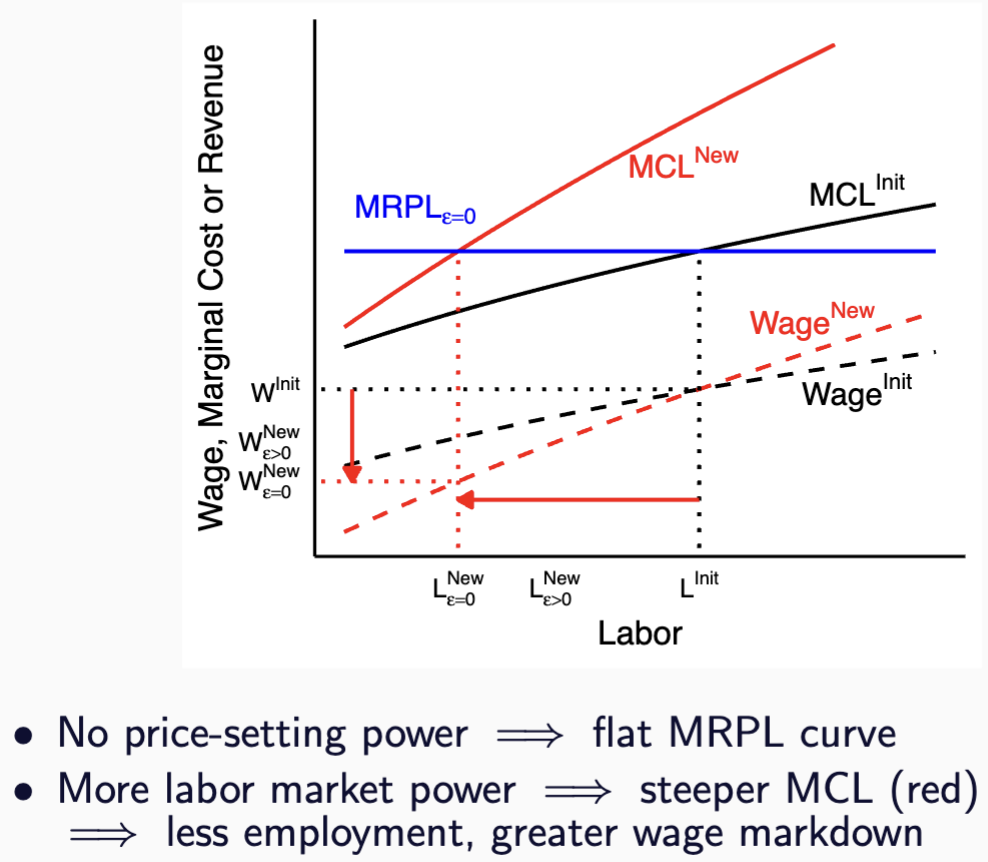
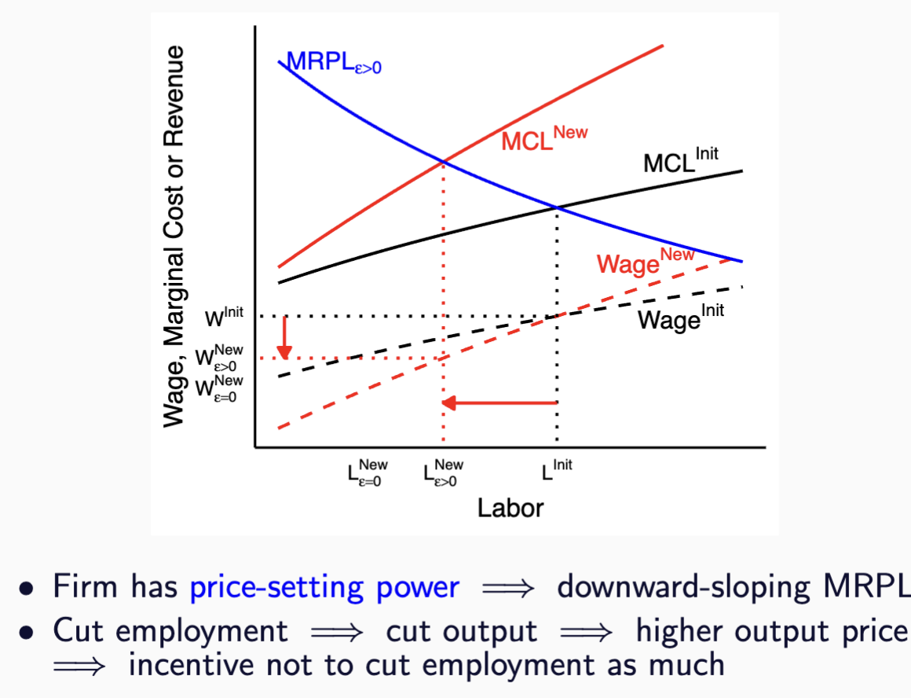

## **This Paper Starts with a Simple Observation**

**Firms Operate and Have Market Power on Two Markets**

Two sources of market power are the focus of distinct literatures:

-   [Labor market]{style="color:orange;"}: firms may mark down wages below MRPL.
-   [Product market]{style="color:blue;"}: firms may mark up prices above MC.

[When excercising labor market power, lower $L$ leads to a lower $w$ - presumably a higher markdown]{.fragment}

[But, this also means lowering $Q$, higher prices]{.fragment}

[**How important are the interaction between the two forces?**]{.fragment}

## **Why is this important? Limit to single market analyses**

How much change should we see if we increase labor market power?

::: columns{.fragment}

::: {.column width="50%"}
### Without Prod. Market Power
{width="80%"}
:::

::: {.column width="50%"}
### With Prod. Market Power
{width="100%"}
:::

:::
<!-- Why is the red steeper line represents more labor market power? -->
<!-- For the same wage decrease, lose less workers. Less elastic labor supply -->

## **This Paper**
**The logic is simple**: Labor and Product Market Power Attenuate Each Other

**But:** What are the magnitudes? 

[**Context:** U.S. Construction Sector - Firm Balance Sheets and Tax Returns]{.fragment}

::: {.fragment}

**Framework**

• Model the [product]{style="color:blue;"} and [labor]{style="color:orange;"} markets jointly

• Closed-form identification of all model parameters.

:::

## **Contribution**
The author states many contributions. I think the most important is:

**Markdown(up) determined by not only the labor(product) market elasticity**

Therefore, the effect of an intervention that work on only one market will be overestimated

## **Contribution**
**Double markdown**: Substituting into the **wage** expression,

$$
W_{jt} = \underbrace{\overbrace{(1+\theta)^{-1}}^{\substack{\text{\color{orange}labor} \\ \text{\color{orange}markdown}}} \times \overbrace{(1-\epsilon)}^{\substack{\text{\color{blue}product} \\ \text{\color{blue}inverse markup}}}} _{\text{\color{orange}double markdown}} \times \overbrace{P_{jt} \text{MPL}_{jt}}^{\text{value of MPL}}
$$

**Double markup**: Substituting into the **price** expression,

$$
P_{jt} = \underbrace{\overbrace{(1-\epsilon)^{-1}}^{\substack{\text{\color{blue}product} \\ \text{\color{blue}markup}}} \times \overbrace{(1+\theta)}^{\substack{\text{\color{orange}labor} \\ \text{\color{orange}inverse markdown}}}} _{\text{\color{blue}double markup}} \times \overbrace{\frac{W_{jt}}{\text{MPL}_{jt}}}^{\substack{\text{prod.-adjusted} \\ \text{wage}}}
$$

## **Roadmap**
-   Model and Identification
    -   Labor Market
    -   Technology
    -   Firms' Problem
-   Data
-   Quantification/Counterfactuals